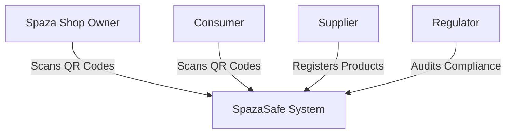
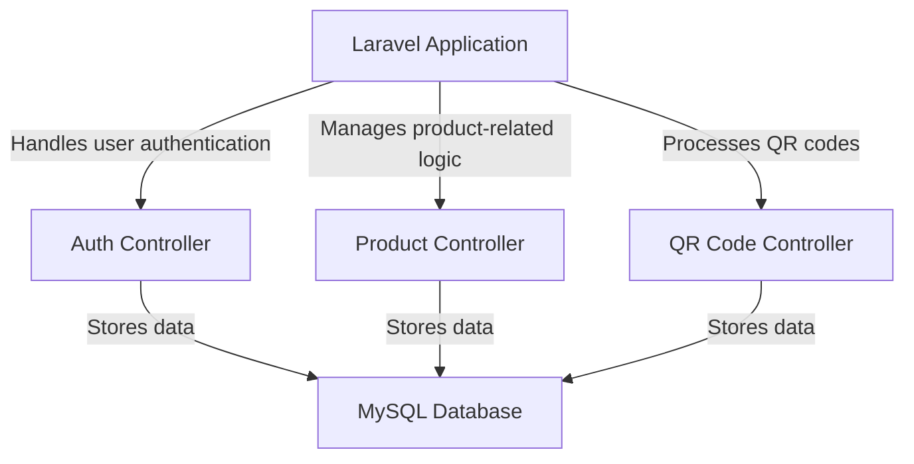

# ARCHITECTURE.md

## 1. Project Title
**SpazaSafe: Counterfeit & Expired Product Detection System**

## 2. Domain
**Informal Retail & Consumer Safety**  
SpazaSafe operates within the informal retail sector, aiming to enhance product authenticity and safety in Spaza shops across South Africa. The system integrates QR codes, suppliers, shop owners, and regulatory bodies to ensure safe and legitimate products are sold.

## 3. Problem Statement
Spaza shops often sell expired or counterfeit products due to weak supply chain transparency. Consumers face health risks, and legitimate suppliers lose revenue. SpazaSafe addresses this issue by providing QR-based product authentication, supplier verification, and regulatory tracking.

## 4. C4 Architectural Diagrams

### 4.1 Context Diagram
Illustrates how SpazaSafe interacts with different users and external systems.



### 4.2 Container Diagram
Breaks the system into major components (backend, frontend, database, integrations).

```mermaid
flowchart TB
  A[Frontend (React/Vue)] -->|API Requests| B[Backend (Laravel API)]
  B -->|Reads/Writes Data| C[MySQL Database]
  B -->|QR Code Validation| D[QR Code API]
```

### 4.3 Component Diagram
Details key components within the system.

```mermaid
flowchart TB
  A[Backend (Laravel API)] -->|User Authentication| B[Authentication Service]
  A -->|Product Verification| C[Product Verification Service]
  A -->|Tracks Deliveries| D[Delivery Tracking Service]
  A -->|QR Code Processing| E[QR Code Service]
```

### 4.4 Code Diagram (Level 4 - Code Structure)
Defines high-level structure for Laravel application.



---
This document provides a clear architectural overview of SpazaSafe using the **C4 model** with **Mermaid syntax**. Let me know if you need modifications! 🚀
