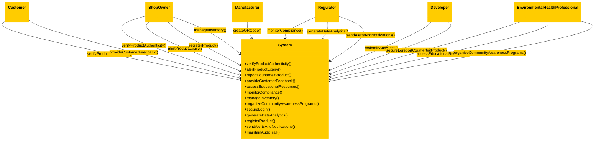

```mermaid
%%{init: {'theme': 'base', 'themeVariables': { 'primaryColor': '#ffcc00', 'primaryTextColor': '#000000', 'primaryBorderColor': '#ffcc00', 'secondaryColor': '#ff9900', 'secondaryBorderColor': '#ff9900', 'tertiaryColor': '#ff6600', 'tertiaryBorderColor': '#ff6600', 'tertiaryTextColor': '#000000'}}}%%
classDiagram
    actor Customer
    actor ShopOwner
    actor Manufacturer
    actor Regulator
    actor Developer
    actor EnvironmentalHealthProfessional

    class System {
        +verifyProductAuthenticity()
        +alertProductExpiry()
        +reportCounterfeitProduct()
        +provideCustomerFeedback()
        +accessEducationalResources()
        +monitorCompliance()
        +manageInventory()
        +organizeCommunityAwarenessPrograms()
        +secureLogin()
        +generateDataAnalytics()
        +registerProduct()
        +sendAlertsAndNotifications()
        +maintainAuditTrail()
    }

    Customer --> System : verifyProductAuthenticity()
    Customer --> System : provideCustomerFeedback()
    ShopOwner --> System : verifyProductAuthenticity()
    ShopOwner --> System : alertProductExpiry()
    ShopOwner --> System : registerProduct()
    ShopOwner --> System : manageInventory()
    Manufacturer --> System : createQRCode()
    Regulator --> System : monitorCompliance()
    Regulator --> System : generateDataAnalytics()
    Regulator --> System : sendAlertsAndNotifications()
    Developer --> System : maintainAuditTrail()
    Developer --> System : secureLogin()
    EnvironmentalHealthProfessional --> System : reportCounterfeitProduct()
    EnvironmentalHealthProfessional --> System : accessEducationalResources()
    EnvironmentalHealthProfessional --> System : organizeCommunityAwarenessPrograms()
```
